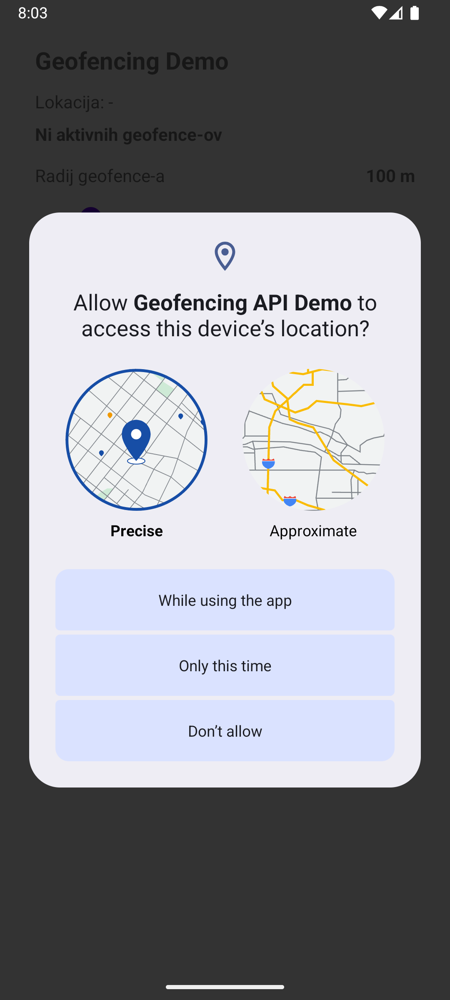
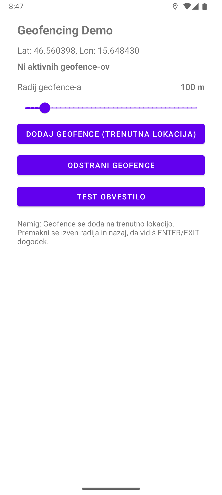
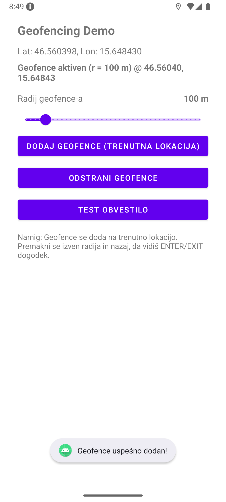
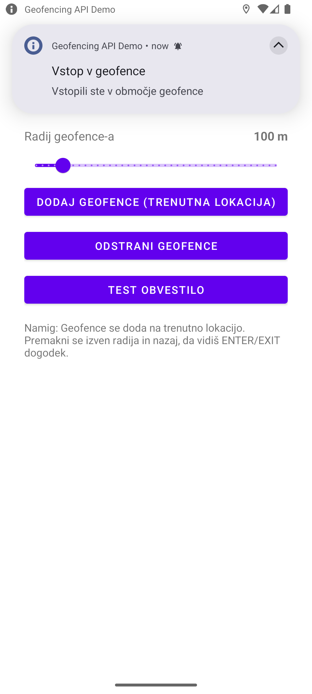
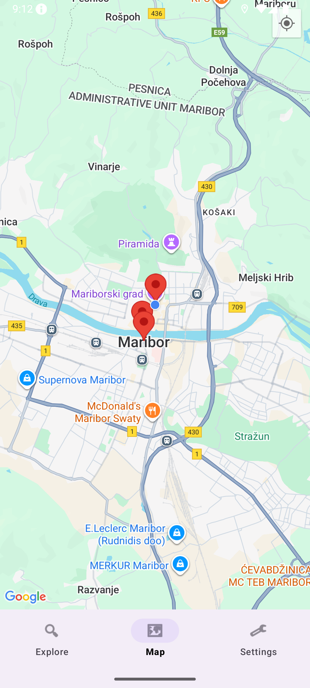
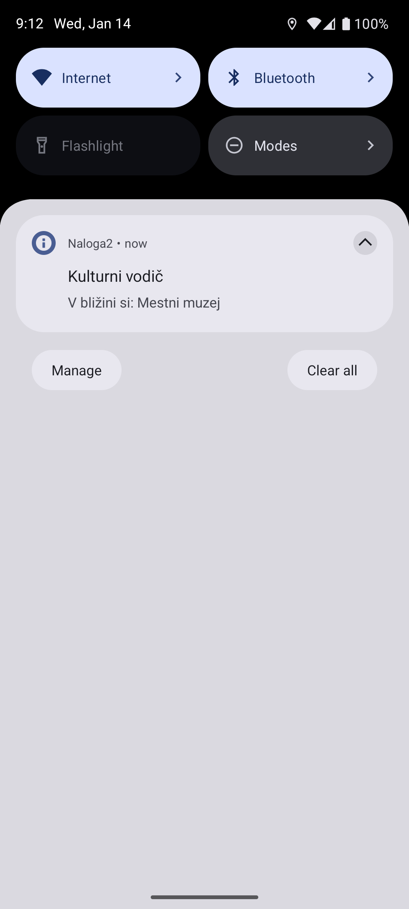
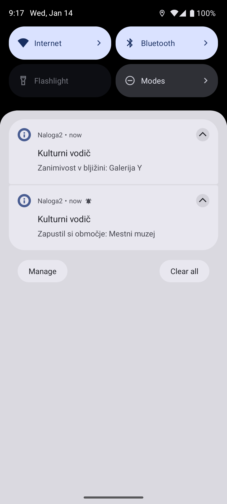

# Android Geofencing
## Opis in utemelitev izbire
Android Geofencing API je del storitve Google Play Services Location in omogoča aplikacijam zaznavanje, kdaj uporabnik vstopi v ali iztopil vnaprej določeno geografsko območje (geofence). Tehnologija omogoča razvoj lokacijsko odvisnih funkcionalnosti in ne zahteva neprekinjenega spremljanja uporabnikove GPS lokacije.

Tehnologijo sem uporabil pri moji android aplikaciji Kulturni vodič, saj lahko uporabnika obvesti o atrakcijah v njegovi bljižini.

---

## Prednosti:
- Nizka poraba energije
- Delovanje v ozadju
- Enostavna Integracija


## Slabosti:
- Odvisnost od Google Play Services
- Omejeno število geofencev
- Zahteva dovoljenja
- Zamik pri zaznavanju
- Težja emulacija

## Licenca
Android Geofencing API je del Google Play Services, ki je na voljo pod Google APIs Terms of Service. Koda je licencirana pod licenco Apache 2.0, ki omogoča:

- prosto uporabo tehnologije za osebne, izobraževalne in komercialne namene
- spreminjanje in prilagajanje kode brez posebnih omejitev
- distribucijo programske opreme ob upoštevanju pogojev licence

## Uporabniki in razširjenost
Android Geofencing API je del operacijskega sistema Android, ki je na voljo na več kot 3 milijardah naprav.

- Uporabljajo ga večje aplikacije kot so Google Maps, in se mnogo drugih na Google Play Store

## Časovna in prostorska zahtevnost

| Lastnost | Ocena |
|--------|------|
| Časovna zahtevnost | O(1) na dogodek |
| Prostorska zahtevnost | O(n), kjer je n število geofence-ov |
| Poraba baterije | nizka |
| Poraba pomnilnika | zanemarljiva |

##  Vzdrževanje tehnologije
- Razvijalec: Google  
- Število razvijalcev: ni točno znano  
- Status: aktivno vzdrževano
- Zadnja sprememba: Maj 2024, različica 21.3.0

---

## Demo

### 1. Dovoljenja

v manifest je potrebno naslednja dovoljenja: 
```kotlin
<!-- Location permission -->
    <uses-permission android:name="android.permission.ACCESS_FINE_LOCATION" />
    <uses-permission android:name="android.permission.ACCESS_COARSE_LOCATION" />

    <!-- For Android 10+ - access to location in the background -->
    <uses-permission android:name="android.permission.ACCESS_BACKGROUND_LOCATION" />

    <!-- For Android 13+ - notifications -->
    <uses-permission android:name="android.permission.POST_NOTIFICATIONS" />

    <!-- Internet for Google Play Services -->
    <uses-permission android:name="android.permission.INTERNET" />
```
### 2. Build
Spodaj je prikazan uporaba Geofence.Builder, ki ustvari geofence:
```kotlin
fun addGeofence(latitude: Double, longitude: Double, radius: Float) {

    val geofence = Geofence.Builder()
        .setRequestId("DEMO_GEOFENCE") //id je string da lahko prepoznamo ta geofence
        .setCircularRegion(latitude, longitude, radius) //dodamo regijo okoli geofnece
        .setExpirationDuration(Geofence.NEVER_EXPIRE) //geofence se po dolocenem casu lahko sama odstrani
        .setTransitionTypes(
            Geofence.GEOFENCE_TRANSITION_ENTER or //kdaj se sprozi alert
            Geofence.GEOFENCE_TRANSITION_EXIT
        )
        .build()

    val geofencingRequest = GeofencingRequest.Builder()
        .setInitialTrigger(GeofencingRequest.INITIAL_TRIGGER_ENTER) //ce je uporabnik ze znotraj ko nastane se sprozi alert
        .addGeofence(geofence)
        .build()

    geofencingClient.addGeofences( // Dodaj geofence v sistem
        geofencingRequest,
        geofencePendingIntent
    )
}
```
### 3. PendingIntent
PendingIntent omogoča sistemu Android, da pošlje dogodke (npr. vstop ali izstop iz območja) aplikaciji – tudi če ta ni aktivna v ospredju.

```kotlin
private val geofencePendingIntent: PendingIntent by lazy {
        val intent = Intent(context, GeofenceBroadcastReceiver::class.java) //kam se poslje dogodek
        PendingIntent.getBroadcast( //ustvari PendingIntent, ki se lahko sprozi v prihodnosti
            context, // kontekst aplikacije
            0,  // requestCode (identifikator)
            intent, // ciljni Intent
            PendingIntent.FLAG_MUTABLE or PendingIntent.FLAG_UPDATE_CURRENT  // obnašanje PendingIntent-a
        )
    }
```

### 4. Obdelava
BroadcastReceiver, ki ga moramo predhodno registrirati v AndroidManifest.xml, prejme geofence dogodke (vstop ali izstop) in jih prikaže z obvestilom.
```kotlin
class GeofenceBroadcastReceiver : BroadcastReceiver() {

    override fun onReceive(context: Context, intent: Intent) {
        val event = GeofencingEvent.fromIntent(intent) ?: return

        when (event.geofenceTransition) {
            Geofence.GEOFENCE_TRANSITION_ENTER ->
                showNotification(context, "Geofence", "Vstop v območje")

            Geofence.GEOFENCE_TRANSITION_EXIT ->
                showNotification(context, "Geofence", "Izhod iz območja")
        }
    }
}
```

## Posnetki zaslona

| Dovoljenje za lokacijo | Glavni zaslon |
|------------------------|------------------------|
|  |  |
| Dovoljenje za lokacijo | Obvestilo |
|  |  |

## Izjeme 
### 1. Manjkajoča dovoljenja
```kotlin
try {
    geofencingClient.addGeofences(geofencingRequest, geofencePendingIntent)
} catch (e: SecurityException) {
    // Uporabnik ni odobril potrebnih dovoljenj
    Log.e("Geofence", "Dovoljenja za lokacijo niso odobrena", e)
    // Preusmeri uporabnika na prošnjo za dovoljenja
    requestLocationPermissions()
}
```
### 2. izklopljene lokacijske storitve
```kotlin
 val task = settingsClient.checkLocationSettings(builder.build())
  task.addOnFailureListener { exception ->
      if (exception is ResolvableApiException) {
          // Lokacijske storitve so onemogočene
          try {
              exception.startResolutionForResult(
                  this,
                  REQUEST_CHECK_SETTINGS
              )
          } catch (sendEx: IntentSender.SendIntentException) {
              Log.e("Location", "Napaka pri prikazu dialoga", sendEx)
          }
      }
  }
```

### 3. Napaka Google Play Services
```kotlin
 fun ensurePlayServices(activity: Activity): Boolean {
    val api = GoogleApiAvailability.getInstance()
    val status = api.isGooglePlayServicesAvailable(activity)

    if (status == ConnectionResult.SUCCESS) return true

    if (api.isUserResolvableError(status)) {
        api.getErrorDialog(activity, status, 1001)?.show()  // ponudi update/install
    }
    return false
}
```

### 4. Preseženo število geofence
```kotlin
 fun replaceGeofence(
    geofencingClient: GeofencingClient,
    request: GeofencingRequest,
    pendingIntent: PendingIntent
) {
    geofencingClient.removeGeofences(pendingIntent)
        .addOnCompleteListener {
            geofencingClient.addGeofences(request, pendingIntent)
        }
}
```

## Uporaba v nalogi
Geofence sem uporabil pri nalogi. Naslov moje naloge je Kulturni vodič, kjer lahko uporabnik preko aplikacije spremlja različne muzeje, galerije in arhive. Geofence je za to nalogo se posebej primeren, saj so velikokrat manjsi muzeji ali rastave skrite. S pomočjo Geofence pa lahko uporabnika opozorim da se približuje ali da je v bljižini kakšne zanimivosti.

| Zemljevid | Obvestilo-vhod | Obvestilo-izhod |
|------------------------|------------------------|------------------------|
|  |  |  |
